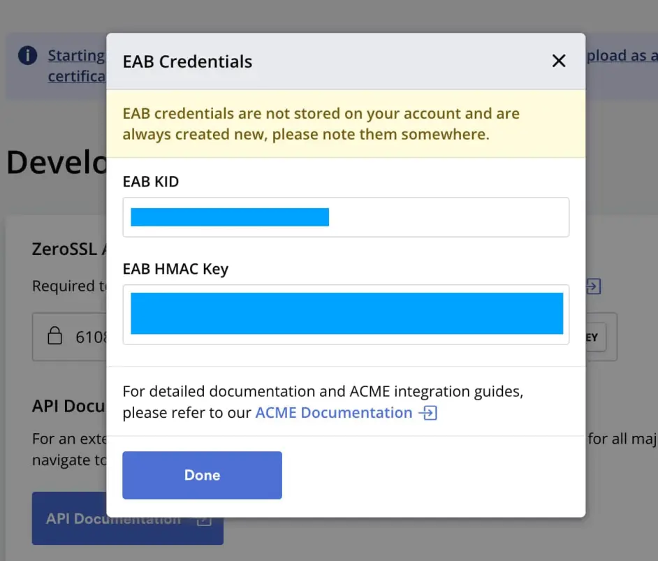
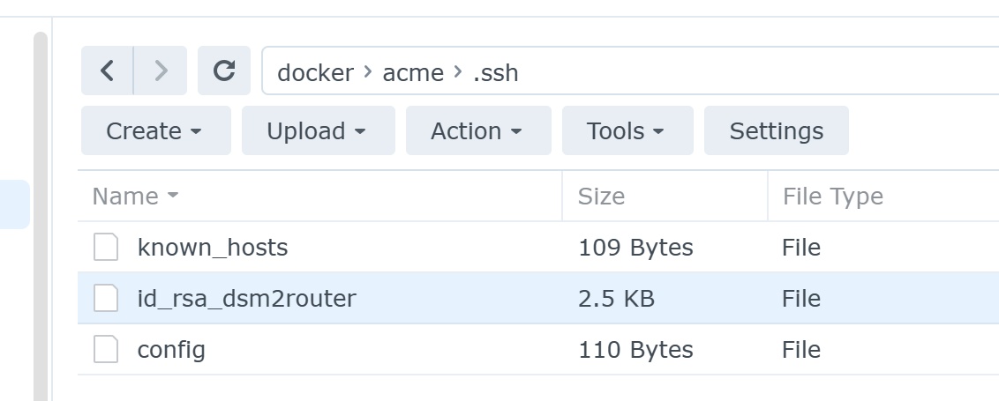

## Register a ZeroSSL account and generate EAB credentials

Here's the link to create EAB credentials:

[https://app.zerossl.com/developer](https://app.zerossl.com/developer)



## Create a scheduled task to run a script that auto renew the certificate

### Prepare the script and folder

Create a folder **/volume1/docker/acme**

Put this script in the folder and name the script file as **my_update_ssl.sh**.

Note:

* I am using **5001** as **HTTPS** port for my DSM, you may change it or remove it if you use **HTTP** instead.
* I also want to deploy the certificate to my router, so in the script I mapped a .ssh directory into the docker so that I can use the SSH key. You may remove that -v "${ACME_VOLUME}/.ssh":/root/.ssh line and the part of step 5).

```sh
#! /bin/bash

export ACME_VOLUME=/volume1/docker/acme
export DOMAIN=YOUR_DOMAIN_NAME.com

echo ">>>>>>> Ken: ==== Begin of my SSL update script ===="

echo ">>>>>>> Ken: 1) Running acme.sh daemon..."

docker run --rm  -itd  \
  -v "${ACME_VOLUME}":/acme.sh  \
  -v "${ACME_VOLUME}/.ssh":/root/.ssh \
  --net=host \
  --name=acme.sh \
  neilpang/acme.sh daemon

echo ">>>>>>> Ken: 2) Registering ZeroSSL account"

docker exec acme.sh \
--register-account --server zerossl --eab-kid "YOUR_EAB_KID" --eab-hmac-key "YOUR_EAB_HMAC_KEY"

echo ">>>>>>> Ken: 3) Creating a certificate"

docker exec \
-e CF_Token="YOUR_CLOUDFLARE_TOKEN" \
-e CF_Email="YOUR_EMAIL" \
acme.sh \
--issue --dns dns_cf --dnssleep 60 -d "${DOMAIN}" -d "*.${DOMAIN}" --server zerossl

echo ">>>>>>> Ken: 4) Deploying the certificate"

# see cookie for your DSM from edge browser (if your DSM's IP is 192.168.1.200):
# edge://settings/cookies/detail?site=192.168.1.200

docker exec \
-e SYNO_Username="YOUR_DSM_USER_NAME" \
-e SYNO_Password="YOUR_DSM_PASSWORD" \
-e SYNO_Certificate="" \
-e SYNO_Scheme="https" \
-e SYNO_Port="5001" \
-e SYNO_DID='YOUR_DSM_DID_IF_YOU_USE_2FA' \
acme.sh \
--deploy --insecure -d "${DOMAIN}" -d "*.${DOMAIN}" \
--deploy-hook synology_dsm

echo ">>>>>>> Ken: 5) Deploying the certificate to the OpenWrt router"

docker exec \
-e DEPLOY_SSH_USER="root" \
-e DEPLOY_SSH_SERVER="router" \
-e DEPLOY_SSH_KEYFILE="/etc/uhttpd.key" \
-e DEPLOY_SSH_CERTFILE="/etc/uhttpd.crt" \
-e DEPLOY_SSH_BACKUP=yes \
-e DEPLOY_SSH_BACKUP_PATH="/etc/uhttpd_crt_bk/" \
-e DEPLOY_SSH_REMOTE_CMD="service uhttpd restart" \
acme.sh \
--deploy -d "${DOMAIN}" -d "*.${DOMAIN}" \
--deploy-hook ssh

echo ">>>>>>> Ken: Stopping acme.sh"

docker stop acme.sh

echo ">>>>>>> Ken: #### End of my SSL update script ####"
```

In order to use SSH in the docker (to connect to my router and transfer the certificate key), I have also done these:

* [Generated a SSH key pair]( "Generated the SSH key pair") **id_rsa_dsm2router** without passphrase

* Put the SSH private key to the **/volume1/docker/acme/.ssh** folder

* Run the docker as shown in the docker run --rm ... script above, then 

  ```sh
  docker exec -it acme.sh sh
  ```

  then inside the docker's shell, execute 

  ```sh
  ssh-add ~/.ssh/id_rsa_dsm2router
  ```

  I also added a config file like this: 

  ```
  Host router
  	HostName 192.168.1.100
      User root
      Port 10022
  	IdentityFile ~/.ssh/id_rsa_dsm2router
  ```

  As shown below, the file structure should be:

  

For information about **SYNO_DID** and deploying through **HTTPS**, check this:

https://github.com/acmesh-official/acme.sh/wiki/Synology-NAS-Guide#deploy-the-default-certificate

For information about deploying certificate through SSH with acme.sh, see:

https://github.com/acmesh-official/acme.sh/wiki/deployhooks#examples-using-ssh-deploy

For uHTTPd web configuration in OpenWrt, see:

https://openwrt.org/docs/guide-user/services/webserver/uhttpd

### Create a scheduled task

Open **Control Panel**, **Task Scheduler**, create a new **scheduled task**/**User-defined script**.

Name it as **acme**, run as **root**.

Schedule it to run **Repeat monthly**.

On **Task Settings**, enter this for the **User-defined script**:

```bash
bash /volume1/docker/acme/my_update_ssl.sh >>/volume1/docker/acme/log_acme/log.txt 2>&1
```

A note for the meaning:

it run the script, then redirect the output to the log.txt.

> That part is written to stderr, use 2> to redirect it. For example:
>
> foo > stdout.txt 2> stderr.txt
> or if you want in same file:
>
> foo > allout.txt 2>&1

> File descriptor 1 is the standard output (`stdout`).
> File descriptor 2 is the standard error (`stderr`).
>
> At first, `2>1` may look like a good way to redirect `stderr` to `stdout`. However, it will actually be interpreted as "redirect `stderr` to a file named `1`".
>
> `&` indicates that what follows and precedes is a *file descriptor*, and not a filename. Thus, we use `2>&1`. Consider `>&` to be a redirect merger operator.

https://stackoverflow.com/questions/818255/what-does-21-mean

https://stackoverflow.com/questions/6674327/redirect-all-output-to-file-in-bash
