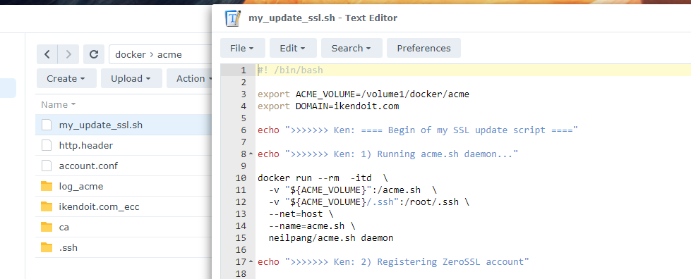

## 注册 ZeroSSL 账号并生成 EAB 凭证

通过这个网址注册并生成凭证：

[https://app.zerossl.com/developer](https://app.zerossl.com/developer)


## 创建计划任务以运行自动续订证书的脚本

### 准备脚本和文件夹

创建一个文件夹，路径为： **/volume1/docker/acme**

将脚本放在这个文件夹里，并将脚本文件命名为 **my_update_ssl.sh**.



注意：

* 我是用 **5001** 作为我的 NAS 的 **HTTPS** 登录端口，你可以根据自己情况进行修改
* 我还在脚本里加入了把证书部署到路由器的代码，只是作为练手使用。为了实现这个目的，我把 .ssh 目录挂载到 docker 里以便使用 SSH 密钥。 如果你不需要的话可以删除 -v "${ACME_VOLUME}/.ssh":/root/.ssh 这一行以及忽略第五步

```sh
#! /bin/bash

export ACME_VOLUME=/volume1/docker/acme
export DOMAIN=你的域名.com

echo ">>>>>>> Ken: ==== SSL 更新开始 ===="

echo ">>>>>>> Ken: 1) 准备运行 acme.sh ..."

docker run --rm  -itd  \
  -v "${ACME_VOLUME}":/acme.sh  \
  -v "${ACME_VOLUME}/.ssh":/root/.ssh \
  --net=host \
  --name=acme.sh \
  neilpang/acme.sh daemon

echo ">>>>>>> Ken: 2) 注册 ZeroSSL 账号"

docker exec acme.sh \
--register-account --server zerossl --eab-kid "YOUR_EAB_KID" --eab-hmac-key "YOUR_EAB_HMAC_KEY"

echo ">>>>>>> Ken: 3) 生成证书"

docker exec \
-e CF_Token="你的_CLOUDFLARE_TOKEN" \
-e CF_Email="你的EMAIL" \
acme.sh \
--issue --dns dns_cf --dnssleep 60 -d "${DOMAIN}" -d "*.${DOMAIN}" --server zerossl

echo ">>>>>>> Ken: 4) 部署证书"

# 为了查看 SYNO_DID 这个 cookie 的内日，可在 Edge 浏览器打开这个页面（假设你的 NAS 登录地址是 192.168.1.200）：
# edge://settings/cookies/detail?site=192.168.1.200

docker exec \
-e SYNO_Username="你的NAS用户名" \
-e SYNO_Password="你的NAS密码" \
-e SYNO_Certificate="" \
-e SYNO_Scheme="https" \
-e SYNO_Port="5001" \
-e SYNO_DID='你的NAS的DID（如果使用了二步验证才需要）' \
acme.sh \
--deploy --insecure -d "${DOMAIN}" -d "*.${DOMAIN}" \
--deploy-hook synology_dsm

echo ">>>>>>> Ken: 5) 把证书部署到 OpenWrt 路由器（不需要的话删除这一段）"

docker exec \
-e DEPLOY_SSH_USER="root" \
-e DEPLOY_SSH_SERVER="router" \
-e DEPLOY_SSH_KEYFILE="/etc/uhttpd.key" \
-e DEPLOY_SSH_CERTFILE="/etc/uhttpd.crt" \
-e DEPLOY_SSH_BACKUP=yes \
-e DEPLOY_SSH_BACKUP_PATH="/etc/uhttpd_crt_bk/" \
-e DEPLOY_SSH_REMOTE_CMD="service uhttpd restart" \
acme.sh \
--deploy -d "${DOMAIN}" -d "*.${DOMAIN}" \
--deploy-hook ssh

echo ">>>>>>> Ken: 正在停止 acme.sh"

docker stop acme.sh

echo ">>>>>>> Ken: #### SSL 更新结束 ####"
```

为了能通过 SSH 连接到路由器，我还做了这些准备：

* [生成 SSH 密钥对]( "生成 SSH 密钥对") **id_rsa_dsm2router** 并且不带密码

* 把 SSH 密钥放到 **/volume1/docker/acme/.ssh** 文件夹

* 使用上面 docker run --rm ... 的脚本运行 docker，然后

  ```sh
  docker exec -it acme.sh sh
  ```

  接着进入 docker 的 shell，执行：

  ```sh
  ssh-add ~/.ssh/id_rsa_dsm2router
  ```

  我还添加了这个配置文件：

  ```
  Host router
  	HostName 192.168.1.100
      User root
      Port 10022
  	IdentityFile ~/.ssh/id_rsa_dsm2router
  ```

  最终的文件结构如下：

  

如果群晖使用了二步验证，则需要通过浏览器获得 **SYNO_DID** 这个 cookie：

https://github.com/acmesh-official/acme.sh/wiki/Synology-NAS-Guide#deploy-the-default-certificate

关于使用 SSH 部署 acme.sh：

https://github.com/acmesh-official/acme.sh/wiki/deployhooks#examples-using-ssh-deploy

关于装了 OpenWrt 的路由器的 uHTTPd 配置：

https://openwrt.org/docs/guide-user/services/webserver/uhttpd

### 创建计划任务

打开 **控制面板**, **任务计划**，新增一个 **计划的任务**/**用户定义的脚本**。

命名为 **acme**，用户账号设置为 **root**。

在**计划**页面，设置成 **每月重复**。

在**任务设置**页面，底部的用户定义的脚本区域输入下面的代码：

```bash
bash /volume1/docker/acme/my_update_ssl.sh >>/volume1/docker/acme/log_acme/log.txt 2>&1
```


