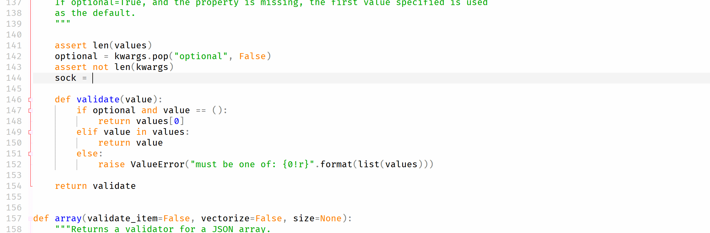
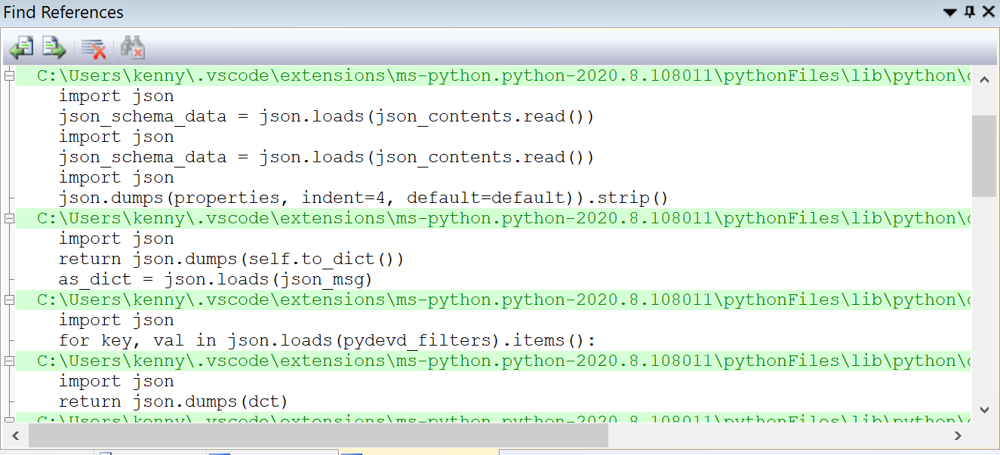

## What is LSP

**LSP** stands for **Language Server Protocol**. Here's an excerpt from Microsoft's [documentation](https://microsoft.github.io/language-server-protocol/overviews/lsp/overview/) for it:

> Implementing support for features like autocomplete, goto definition, or documentation on hover for a programming language is a significant effort. Traditionally this work must be repeated for each development tool, as each provides different APIs for implementing the same features.
> 
> The idea behind a Language Server is to provide the language-specific smarts inside a server that can communicate with development tooling over a protocol that enables inter-process communication.
> 
> The idea behind the Language Server Protocol (LSP) is to standardize the protocol for how tools and servers communicate, so a single Language Server can be re-used in multiple development tools, and tools can support languages with minimal effort.

Microsoft also explains it better [here](https://code.visualstudio.com/api/language-extensions/language-server-extension-guide).

## Objectives

Origin comes with a built-in IDE which is called Code Builder that supports editing different types of source files. I was tasked with implementing some basic "intellisense" features for python, such as auto completion, go to definition, etc. Since LSP defines a set of clear data structures and interfaces for developers who need to implement their own LSP client/server, I decided it is best to avoid reinventing the wheel and follow this protocol.

For the python LSP server/client, Microsoft already [open-sourced](https://github.com/Microsoft/python-language-server) its implementation, so the rest of the major problems that I will have to deal with myself are mostly inter-process communication (socket/pipes/etc.), threading, and UI related issues.

## The result
Now, here's the result of roughly a month's endeavor:

I've also implemented other features such as Go to Definition, Find References, Document Symbol.

