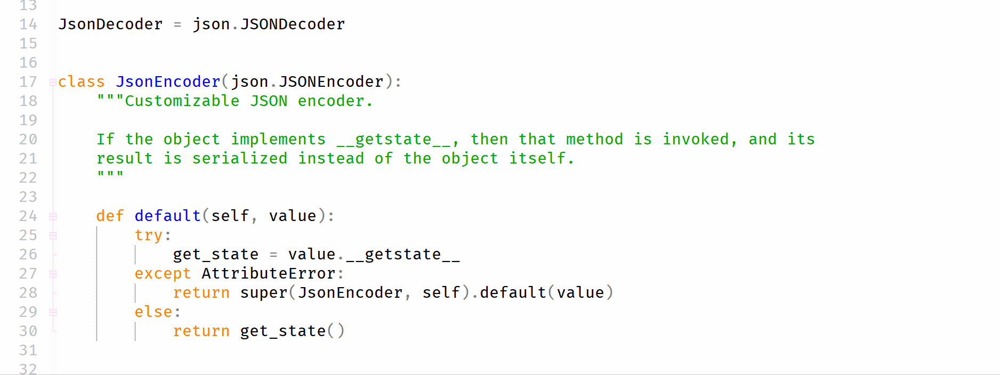
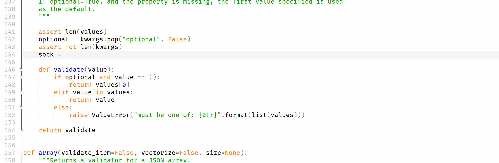
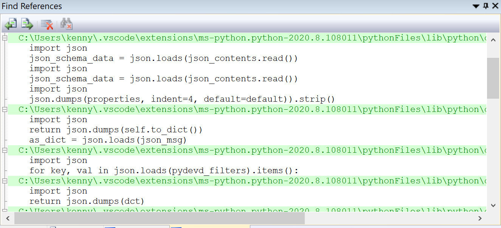

## 什么是 LSP

**LSP** 是指 **Language Server Protocol**. 下面是微软的[定义](https://microsoft.github.io/language-server-protocol/overviews/lsp/overview/):

> Implementing support for features like autocomplete, goto definition, or documentation on hover for a programming language is a significant effort. Traditionally this work must be repeated for each development tool, as each provides different APIs for implementing the same features.
> 
> The idea behind a Language Server is to provide the language-specific smarts inside a server that can communicate with development tooling over a protocol that enables inter-process communication.
> 
> The idea behind the Language Server Protocol (LSP) is to standardize the protocol for how tools and servers communicate, so a single Language Server can be re-used in multiple development tools, and tools can support languages with minimal effort.

Visual Studio Code 在[这里的解释](https://code.visualstudio.com/api/language-extensions/language-server-extension-guide)也很全面。

## 目标

Origin 自带一个名为 Code Builder 的 IDE。我的工作任务是要针对 python 实现包括自动完成，跳转到定义等等的功能。因为 LSP 已经做好了清晰的框架设计和良好的数据结构及接口定义，我就不重新发明轮子自己搞一个协议了。

关于 LSP 的服务器端/客户端，其实微软已经[开源了](https://github.com/Microsoft/python-language-server) 它的实现，所以剩下的主要问题就是我要自己去实现不同语言的直接通信。我选择了通过 socket 来实现。

## 成果
花了一个月左右，终于实现了这些功能：

我还实现了这些功能：跳转到定义位置，查找所有的引用。

