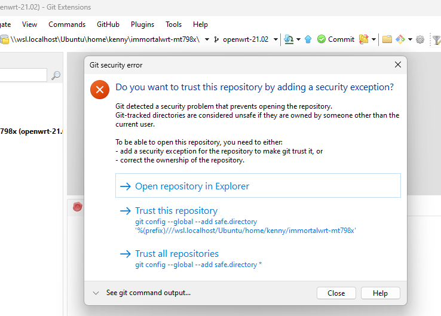

I cloned a repo in WSL in order to build an OpenWrt firmware, but I couldn't open it with Git Extensions:



Even after clicking on the **Trust this repository** button, it still fails to open.

I fixed it by manually running this command:

```powershell
git config --global --add safe.directory '%(prefix)///wsl.localhost/Ubuntu/home/kenny/immortalwrt-mt798x'
```

Reference:

https://github.com/gitextensions/gitextensions/issues/9954
