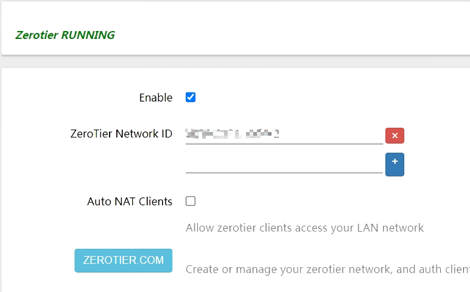

## The problem

I accidentally deleted the wrong member node in my ZeroTier network. Unfortunately the node is running on a router with OpenWRT installed which is far away from my place, I have to devise an easy way for my parents to help me set it up again.

## The trouble

Based on some [research](https://discuss.zerotier.com/t/undelete-a-member/520) online and my observation, my understanding is that once you deleted a member node, it's also banned from re-joining the network. I cannot see the deleted node show up again on the member list from ZeroTier Central. 

## The solution

One way to fix this would be to manually add the member back by entering the address through ZeroTier Central.


So I have to somehow get the address from the device with the help of my parents.

Someone mentioned that you might still be able to see the deleted node from the output of this command:

```bash
zerotier-cli peers
```

But it's been purged from my device, so it's no luck for me.

The OpenWRT on the router is using luci-app-zerotier, and it doesn't seem to display the address from the interface:



There's nothing about ZeroTier address on the **Interface Info** tab too.

The other way to get the address would be running this command on the router which is running the deleted ZeroTier node:

```bash
zerotier-cli info
```

It should output something like this:

```bash
root@openwrt:~# zerotier-cli info
200 info 41c7017c10 ONLINE 1.1.14
```

**41c7017c10** from the above is the address.

Detailed explanation can be seen [here](https://github.com/mwarning/zerotier-openwrt/wiki).

## The second trouble

Now the next trouble is I need to ask my parents to run this command and get the result for me. It wouldn't be easy for them to SSH to the router and type in the command themselves.

Luckily, Shortcuts on iPhone seems to support running script over SSH, so here's how I created my Shortuct:


I then shared the Shortcut to my parents and asked them to run it, it would put the result into the clipboard.

Shortcuts app would show this result:


An alert would also show:


## Another possible solution

There seems to be another way to fix this: reset the deleted node's ZeroTier address:

https://zerotier.atlassian.net/wiki/spaces/SD/pages/327693/How+to+Clear+Reset+your+ZeroTier+Address

I haven't tested this myself, but it looks feasible. I assume after resetting the address, the node will reappear on the member list with a new address, then simply re-authorizing it would work.
