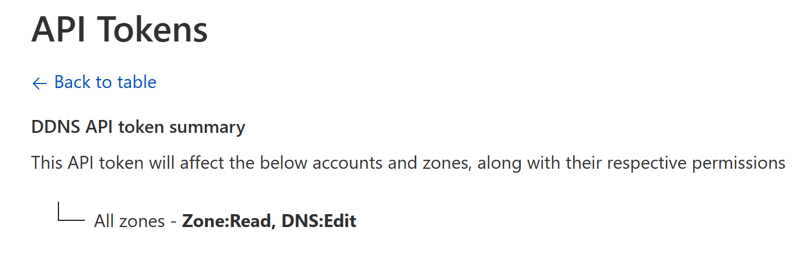

In order to host a web server at home using Cloudflare's DNS service, I found a docker [timothyjmiller/cloudflare-ddns](timothyjmiller/cloudflare-ddns) quite convenient for configuring. And here's the steps to set up in a Synology DSM:

## Prepare files for the docker

### Creating a folder

SSH to the DSM, then create this directory:

**/volume1/docker/cloudflare-ddns**

### Prepare a docker-compose.yml

```yaml
version: '3.9'
services:
  cloudflare-ddns:
    image: timothyjmiller/cloudflare-ddns:latest
    container_name: cloudflare-ddns
    security_opt:
      - no-new-privileges:true
    network_mode: 'host'
    volumes:
      - /volume1/docker/cloudflare-ddns/config.json:/config.json
    restart: unless-stopped
```

### Generate an API token from Cloudflare

Create the API token from Cloudflare's dashborad, or open this link:

https://dash.cloudflare.com/profile/api-tokens/

Make sure it has **DNS:Edit** permission.



**Copy the token** and save it somewhere because it only shows one time on the website!

### Prepare a config.json

```json
{
  "cloudflare": [
    {
      "authentication": {
        "api_token": "Cloudflare_API_Token_Here"
      },
      "zone_id": "Cloudflare_ZoneID_Here",
      "subdomains": [
        {
          "name": "aaa",
          "proxied": true
        },
        {
          "name": "bbb",
          "proxied": false
        }
      ]
    }
  ],
  "a": false,
  "aaaa": true,
  "purgeUnknownRecords": false,
  "ttl": 300
}
```

More detailed explanation can be found here:

https://github.com/timothymiller/cloudflare-ddns#-example-

The folder should look like this:



## Run the docker

With this script:

**docker-compose up -d**

