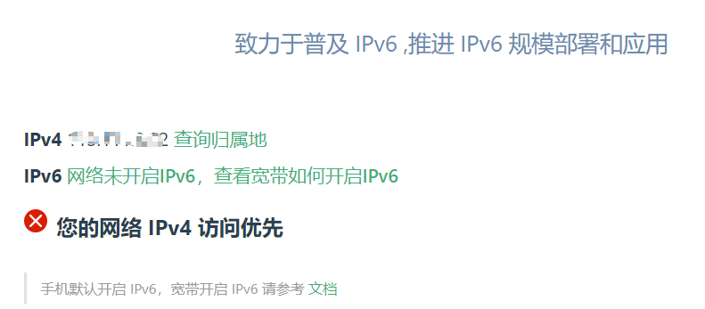
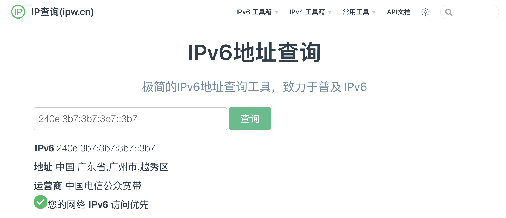

## 目的

中国电信不给分配公网 IPv4 地址了，为了让在外网的时候访问家里的群晖，我想要试试看 IPv6 的方式效果怎样。网上已经有很多教程，但是这些教程互相有矛盾的地方，我折腾了一段时间才总算成功。其实我也没有非常理解这样设置的原理，未免以后忘记怎么配置，在此记录一下，以免将来需要。

## IPv6 的使用条件

IPv6 要求服务器端和客户端都支持 IPv6 环境，否则无法访问。目前手机的移动网络默认都支持 IPv6 了，所以直接可以打开 IPv6 的网站，但是家庭网络和公司的网络就很可能不支持。

## 测试

下面这些网站可以用来测试设备是否处于配置好 IPv6 的网络：

* https://ipw.cn

* http://test-ipv6.com/

例如，访问 ipw.cn 如果出现下面这个结果就表示没有配置 IPv6：

如果成功的话，应该显示如下图：

## 网络环境

按照我的理解，要拿到公网 IPv6 地址，有下面两种选择：

* 光猫拨号，路由器设置桥接模式，所有设备ip均由光猫分配
* 光猫桥接，路由器拨号，如果运营商能正常下发PD，路由器通常也能分配公网 IPv6 地址。

我选择了把电信光猫改成了**桥接**，使用刷了 OpenWrt 的小米路由器来拨号。

## 简要说明

基本上配置重点是除了 **WAN6** 需要打开 “**使用内置的 IPv6 管理**” 这个功能之外，其它接口都要关闭。**WAN6** 为了方便可以直接删除重新添加也没关系，注意接口使用自定义名称 **@wan** 即可。

据说如果能拿到 **IPv6-PD** 是比较理想的情况。

对于 IPv6 来说，似乎 **F** 开头的都不是公网地址。

**FE80** 开头的地址应该属于**链路本地地址**（**Link Local Address**）。

按照网上的说法，公网地址应该是这样的：

* 电信为 **240e** 开头的 （240e::/20）
* 移动为 **2409** 开头的 （2409:8000::/20）
* 联通为 **2408** 开头的 （2408:8000::/20）

## 配置

先上最终配置成功后的接口总览：



### 配置 LAN 接口

找到 **网络/接口/LAN**，点修改

#### LAN 基本设置

进入 **基本设置**，**IPv6 分配长度** 确定为 **64**



#### LAN 高级设置

进入**高级设置**，进行这些改动：

* 取消勾选 **使用内置的 IPv6 管理**
* 勾选 **强制链路**



#### LAN/DHCP 服务器 设置

进行如下设置



### 配置 WAN 接口

找到 **网络/接口/WAN**，点修改

#### WAN 基本设置

这里并没有特别需要改的，因为光猫桥接了，这里设置成 PPPoE 拨号。



#### WAN 高级设置

进入**高级设置**，进行和 LAN 高级设置类似的改动：

* 取消勾选 **使用内置的 IPv6 管理**
* 勾选 **强制链路**



### 配置 WAN6 接口

WAN6 接口可以删除重新添加也无所谓。

#### WAN6 基本设置

协议设置为 **DHCPv6 客户端**



#### WAN6 高级设置

这里的重点就是终于要打开 **使用内置的 IPv6 管理** 了。



#### WAN6 物理设置

把接口设置为 **@wan**



#### WAN6 防火墙设置

注意是和 **wan** 一起的就可以了



### DHCP/DNS 设置

到 网络下的 **DHCP/DNS** 下找到服务器设置/**高级设置**，把 **禁止解析 IPv6 DNS 记录** 取消勾选。


