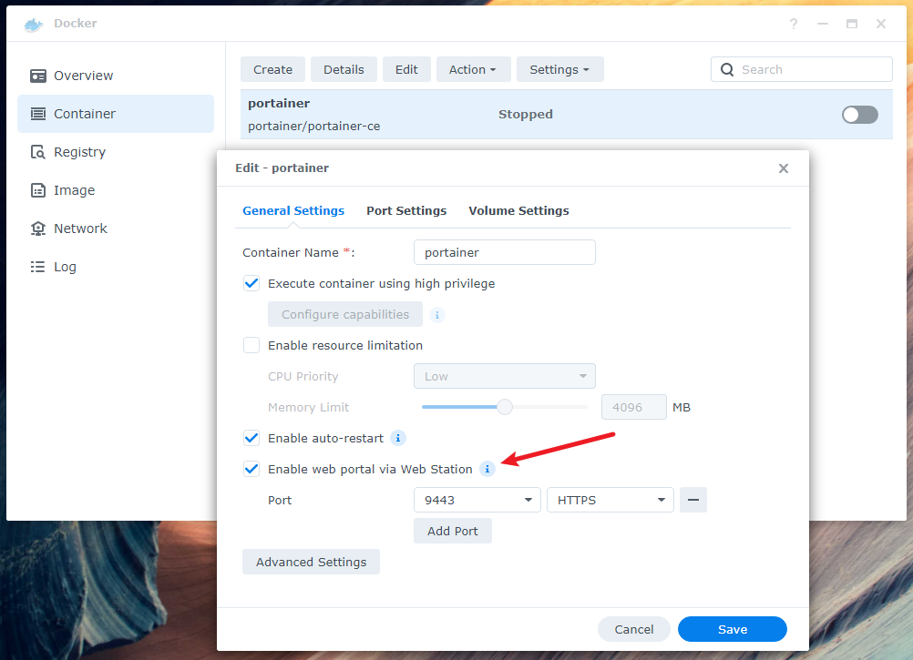
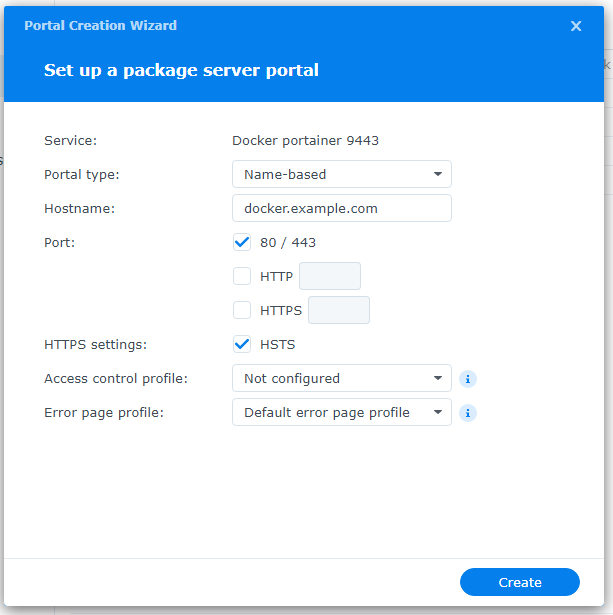

I know there are already a lot of posts online that describe how to setup a Portainer on a Synology DSM, but I am writing this for my own reference.

## Create the docker image

SSH to the Synology, then run the following commands:

```bash
sudo -i

mkdir -p /volume1/docker/portainer

docker create --name=portainer --privileged --restart=always -v /var/run/docker.sock:/var/run/docker.sock -v /volume1/docker/portainer:/data portainer/portainer-ce
```


## Enable web portal

On Docker app, find the portainer container, then check **Enable web protal via Web Station**

Add port **9443** for HTTPS, then hit **Save**.

DSM will prompt to configure the web portal settings in Web Station.



Enter hostname for the web portal, then hit **Create**.



Finally, start the container on Docker app and it's good to go.
