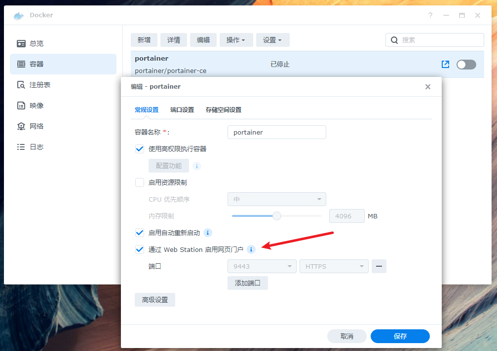
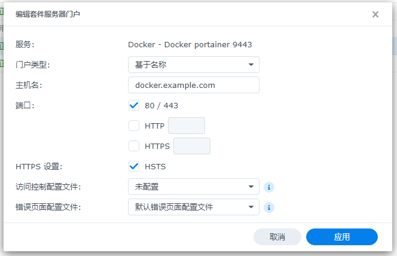

这篇仅供我日后参考使用。

## 创建容器

SSH 连接到群晖，并执行下面的代码：

```bash
sudo -i

mkdir -p /volume1/docker/portainer

docker create --name=portainer --privileged --restart=always -v /var/run/docker.sock:/var/run/docker.sock -v /volume1/docker/portainer:/data portainer/portainer-ce
```


## 启用网络入口并设置域名

在 Docker 里找到 portainer 容器后选择编辑，勾选 **通过 Web Station 启用网页门户**

添加端口，指定 **9443** 为 HTTPS



然后输入域名即可


