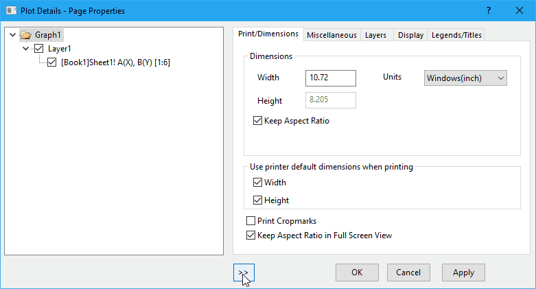

We have a expand/shrink button on this particular dialog when users click on it, it expands or shrinks the dialog, but the tab control "remains" at the original position relative to the screen coordinates. 

Notice the significant flickering here, what is happening? Let's slow it down:

As you see, the tab control was "moved" (actually, here it simply stayed at the original distance to the left edge of the dialog, this is done by windows manager) to the right side of the dialog when the dialog is shrunk, and then later it was moved (this time, an actual **SetWindowPos** call) back to the left side. When we click on the button again to expand the dialog, a similar thing happens. The tab control will be "moved" to the left side, then moved back to the right side of the dialog. Interestingly, the same issue does not exist if we were to do the opposite. That is to say, if the tab control was designed to be placed at the left side of the dialog and clicking the expand/shrink button should resize the right edge of the dialog (instead of the left edge), there will be no noticeable flickering. More interestingly, however, when I resize the dialog by dragging the left edge of it, there is no flickering at all. 

 

IIRC, dialogs on Windows used to flicker a lot when users drag and resize from top/left edge of it, resizing from bottom/right edge of the dialog does not produce flickering. It seems that Windows does quite a bit of work behind the scene to make the resizing appears as smooth as possible. How can I solve this flickering issue anyway? This time, I have been struggling with this problem for quite a few days and still couldn't find out the solution. It really is a nightmare. Anyway, I posted this question on [MSDN forum](https://social.msdn.microsoft.com/Forums/vstudio/en-US/93ad3a77-90ab-46fa-adc1-b5fe3af05767/reduce-flickering-when-using-setwindowpos-to-change-left-edge-of-a-window) and [StackOverflow](https://stackoverflow.com/questions/50898990/reduce-flickering-when-using-setwindowpos-to-change-the-left-edge-of-a-window), but no luck. Viorel\_ from the MSDN post did suggest this solution, which kind of solve the flickering when shrinking the dialog:

> For the case of shrinking, try moving the control in advance (in_ExpandShrinkWindow_): _. . . SetWindowPos( g\_hwndListRight, NULL, g\_nGap, g\_nGap, 0, 0, SWP\_NOZORDER | SWP\_NOACTIVATE | SWP\_NOSIZE ); SetWindowPos( hWnd, . . . ); . . ._

However, this won't work when the dialog expands. I found that there is already another [post from MSDN forum](https://social.msdn.microsoft.com/Forums/windowsdesktop/en-US/96fbddcd-559e-4fe9-95b3-3ee16b67fa8d/dialogs-children-flickering-during-resizing) asking the exact same question, and the guy who asked the question later replied his/her interesting obersations:

> I've many years of Windows development and the problem, I think, is more difficult than a simple wm\_erasebkgnd management. I think it involves the DWM and the UXTHEME features. You can get  a better result if you take into account the WM\_NCCALCSIZE message, but the problem is still there. It's not "linked" with dialogs. You'll get the same bad result with a new simple win32 app generated by VStudios. If you change your theme into Windows Classic the problem disappear as well as DWM and UXTHEME in the Windows events queue. If you change your theme into Windows 7 theme the problem disappear again since DWM and UXTHEME work well. The problem arises if you use Windows 7 basic theme. There is some sort of bad or incosistent work between DWM and UXTHEME. EDIT: Create a simpe win32 app, default code by VS, and set Windows 7 basic theme. Run the app and resize the window dragging the left edge of it a little bit faster. Look to the right edge or right border of the window, do you see the flicker?
> 
> Thanks for your answer.

Unfortunately, it looks like I've come to a dead end.