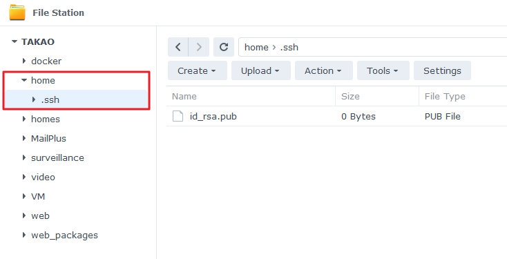

## Generating key pair

On Microsoft's website there's already a post for this:

https://learn.microsoft.com/en-us/windows-server/administration/openssh/openssh_keymanagement

Run **PowerShell** with administrative access.

Run **ssh-keygen** to generate an RSA key pair. 

```powershell
PS C:\Users\kenny> ssh-keygen
```

You will be prompted to enter the file location. I use **id_rsa_test** here.

```
Enter file in which to save the key (C:\Users\kenny/.ssh/id_rsa): C:\Users\kenny\.ssh\id_rsa_test
```

Then enter a passphrase to protect the key.

```
Enter passphrase (empty for no passphrase):
Enter same passphrase again:
Your identification has been saved in C:\Users\kenny/.ssh/id_rsa_test.
Your public key has been saved in C:\Users\kenny/.ssh/id_rsa_test.pub.
The key fingerprint is:
SHA256:OIzc1yE7joL2Bzy8!gS0j8eGK7bYaH1FmF3sDuMeSj8 kenny@LOCAL-HOSTNAME

The key's randomart image is:
+--[RSA 3072]--+
|        .        |
|         o       |
|    . + + .      |
|   o B * = .     |
|   o= B S .      |
|   .=B O o       |
|  + =+% o        |
| *oo.O.E         |
|+.o+=o. .        |
+----[SHA256]-----+
```

Add the key to the ssh-agent so that you won't need to enter the passphrase again.

For Windows, there are a few extra steps before **ssh-add**.

```powershell
# By default the ssh-agent service is disabled. Configure it to start automatically.
# Make sure you're running as an Administrator.
Get-Service ssh-agent | Set-Service -StartupType Automatic

# Start the service
Start-Service ssh-agent

# This should return a status of Running
Get-Service ssh-agent

# Now load your key files into ssh-agent
ssh-add $env:USERPROFILE\.ssh\id_rsa_test
```

## Deploying the public key

### On a Synology DSM

1. Sign in to DSM as an administrator.
2. Go to DSM **File Station** > **home**.
3. Create an sub-folder named **.ssh**.
4. Upload the public key **id_rsa.pub** to the **.ssh** folder.

For more details, see:

https://kb.synology.com/en-uk/DSM/tutorial/How_to_log_in_to_DSM_with_key_pairs_as_admin_or_root_permission_via_SSH_on_computers

### On OpenWrt

To do this from LuCI:

1. Navigate to **LuCI → System → Administration → SSH-Keys**
2. Copy the contents of your public key file. It will be a long string starting with `ssh-rsa ...` and ending with something like `... some-name@some-host.lan`
3. Paste that string into *Paste or drag key file...* field on the web page
4. Click the **Add key** button
5. To test: open a new window in your terminal program and enter `ssh root@your-router-address` You should be logged in without entering your password.

For more details, see:

https://openwrt.org/docs/guide-user/security/dropbear.public-key.auth#from_the_luci_web_interface

## SSH to the host

Because I changed the SSH port number to something else (instead of the default 22), I need to specify the port number in two ways:

* ssh ssh://user@address:port
* ssh -p port user@address

## Removing the private key

Before Remove Identity You need to start `ssh-agent` with this command

```
eval `ssh-agent -s` 
```

For Remove All Identity

```
ssh-add -D
```

To Remove Specific Identity

```
ssh-add -d ~/.ssh/sshkeynamewithout.pub
```

For Find a List of available Identify by using this command

```
ssh-add -l
```

For more details, see:

https://stackoverflow.com/a/73572251

